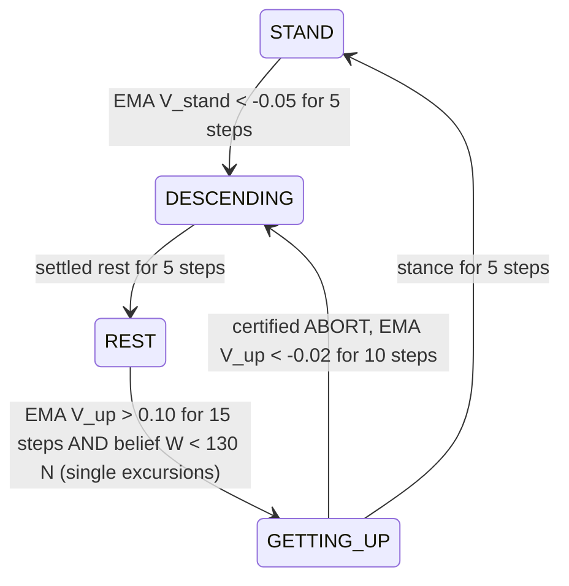
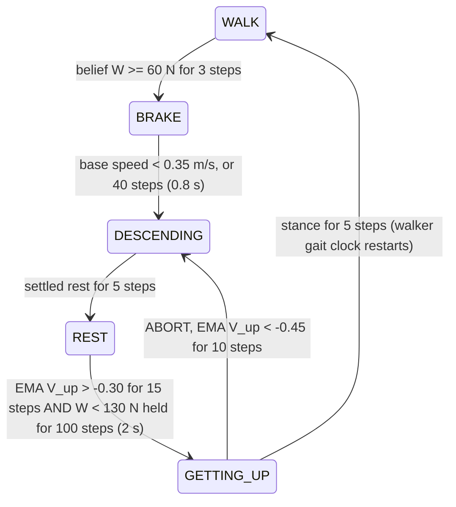

# Switching logic — what guards a transition between ODD modes

The ODD-conditioned safety filter is a small **automaton over specification modes**. Each mode has its own
reach-avoid specification, its own trained expert policy, and that expert's learned value (the mode's
**certificate**). The automaton decides which mode's expert drives the robot; this page states exactly what
has to be true before it moves between modes. Everything here is read off
[`odd_conditioned/automaton.py`](../odd_conditioned/automaton.py) (the logic) and
[`odd_conditioned/scenarios.py`](../odd_conditioned/scenarios.py) (the per-scenario wiring and thresholds).

Control runs at **50 Hz** (`DT = 0.02 s`), so "K steps" below means K × 20 ms.

## 0. Two constructions — don't mix them up

1. **One-way handoff** (the certificate experiments, [`certificates.py`](../odd_conditioned/certificates.py)).
   Two policies per ODD axis — a STAND expert and a REST expert — and a single switch: when the STAND
   certificate collapses, hand the robot to the REST expert and never come back. No transition policies. It
   answers "does the certificate know when to give up standing?" on three axes: carried load, leg derating,
   and leg derating while loaded.
2. **The certified automaton** (the system, [`automaton.py`](../odd_conditioned/automaton.py)). Two **modes**
   (STAND/WALK, REST) plus two **transitions** (descend, get up), each transition its own trained reach-avoid
   policy, so the robot can go down *and come back up* as the ODD changes. The rest of this page is about
   this construction.

## 1. The modes and their experts

| mode | runs | checkpoint (`checkpoints/<name>`) | its certificate |
|---|---|---|---|
| **TASK**, standing | STAND expert | `stand` | `V_stand` |
| **TASK**, walking | nominal joystick walker (no safety training) | `external/go2_atomic_skills` (`walker_actor.pt`) | — |
| **BRAKE** (walking only) | payload walk: the STAND expert · leg-fault walk: the walker with a zero command | — | — |
| **DESCENDING** | descent funnel (`odd`) **or** the REST expert (`odd-rest-descent`, `direct`, `one-way`) | `descend` / `rest` | — |
| **REST** | REST expert: lie down and stay settled | `rest` | — |
| **GETTING_UP** | get-up funnel | `getup` | `V_up` |

Each expert is a two-player (control vs. adversarial push) reach-avoid PPO twin (`ReachAvoidPPO2P` from
safety-stable-baselines). Its value net gives `V(x) ≥ 0` ⇔ "this mode's specification is (estimated) still
satisfiable from here". The runtime reads it as `model.policy.predict_values(norm(obs))` on the 48-d actor
observation (`policies.Twin.value`). All four twins also observe the carried load W, so their policies and
certificates are load-aware. How the two funnels are built: [TRAINING.md](TRAINING.md#the-two-transition-funnels).

### Which policy flies which mode, per scenario

The checkpoints are trained once and shared; what differs is which of them each scenario uses where.

| scenario / method | TASK | BRAKE | DESCENDING | REST | GETTING_UP | values that decide switches |
|---|---|---|---|---|---|---|
| **standing-\*, `odd`** | stand | — | descend | rest | getup | `V_stand` (descent trigger), `V_up` (return + abort) |
| standing-\*, `odd-rest-descent` | stand | — | rest | rest | getup | same |
| **payload-\*, `odd`** | walker | stand | descend | rest | getup | `V_up` only (descent trigger = load belief W ≥ 60 N) |
| **leg-fault, `odd`** | walker | walker, zero command | rest | rest | getup | `V_up` only (descent trigger = torque-saturation residual) |
| weight-walk-\*, `odd` | walker | — | rest | rest | getup | `V_stand` (descent trigger), `V_up` |
| `direct` / `one-way` (any scenario) | stand or walker | as `odd` | rest | rest | — | descent: the scenario's trigger · `direct` return: `V_stand` read while lying down |

So standing `odd` runs exactly four safety policies (STAND, REST, one reach-avoid policy per transition
direction); the payload walk adds the walker as the task policy, with the STAND expert reused as the brake.
In the leg-fault and weight walks the full method descends with the REST expert (the scenario's `descent`
field): those regimes were evaluated with that configuration.

**The leg-fault walk reuses the weight-trained safety policies for a leg fault.** `rest` and `getup` were
trained with a carried load and a healthy leg, never with a derated one; the leg-fault walk runs them at
W = 0. It works because the robot lies down on the weak leg and gets up only after the leg has recovered
(the return gate requires θ ≥ 0.99). The leg-specific experts (`leg_stand`, `compound_*`) belong to the
one-way certificate experiments of §0.

## 2. Signal conditioning (shared by every scenario)

- **EMA filtering**: `v̄ ← (1−α) v̄ + α V`, `ALPHA = 0.1` (≈ 0.2 s time constant), initialised to the first
  reading (initialising at 0 makes the first second read as a collapse).
- **Sustain counters**: a condition must hold for K *consecutive* steps; one miss resets the count.
- **Arming**: no switch fires during the spawn transient — `arm_after = 50` steps (1 s) standing and in the
  weight walk, 100 steps (2 s) in the payload and leg-fault walks.
- **Refractory**: after a trigger, get-up or abort, `REFRACTORY = 50` steps (1 s) before the next one.
- **Target-set completion** (geometric, not learned) — a transition *finishes* only when the robot is in
  the next mode's target set for `SETTLE = 5` consecutive steps (`sim.in_rest_target`, `sim.in_stance_target`):
  - settled rest: base height < 0.15 m, tilt (max |g_x|, |g_y| of projected gravity) < 0.25,
    |v| < 0.30 m/s, |ω| < 0.50 rad/s
  - stance: base height > 0.20 m, tilt < 0.25, |v| < 0.30 m/s

## 3. The full system (`odd`, "ODD-conditioned")

### Standing (scenarios `standing-square`, `-sine`, `-pulse`, `-period`)

- **Descent trigger = the STAND certificate collapsing.** Standing is in-distribution for the stance
  expert, so its own value is a usable detector here.
- **Return = two keys.** The get-up funnel's own certificate `V_up` must say a get-up from *this* pose is
  feasible, **and** the belief must say the ODD has cleared (`LOAD_NOMINAL = 130 N`, the measured
  stand-feasibility boundary). The load *waves* run with the certificate alone (`gate_return=False`): under a
  load that keeps coming back, the belief gate would keep the robot down for good.
- **Abort**: if `V_up` collapses mid-get-up (e.g. the load returns), go back down — the get-up is never
  forced to completion.

### Payload-swap walking (scenarios `payload-pulse`, `-period`, `-dip`)

Differences from standing, each forced by a measured failure:

1. **Belief-primary descent trigger** (60 N, the edge of the walker's comfortable load). `V_stand` read on a
   walking gait is off-distribution: used alone it false-fired on 20–25 % of healthy gaits and fired late on
   the ramp. The value is a certificate, not a fault detector.
2. **BRAKE mode.** A walker given a zero command freezes its gait clock and stumbles, so braking hands the
   robot to the stance expert, which stops it; the descent starts once it is slow. Handoff mortality depends
   on the gait phase (mid-swing dies, stance survives); about half of the remaining deaths happen here.
3. **Debounced return** (2 s of W < 130 N). The `dip` profile lightens the load for ~1.6 s mid-window; that
   must not bait the robot into standing up under a returning crate.
4. **Per-regime certificate thresholds** (`eps_up = -0.30`, `eps_abort = -0.45`). Certificates are ordinal
   off their training distribution; the get-up threshold is calibrated on the rest poses that *this* regime
   produces (`scripts/calibrate.py`).

### Leg-fault walking (scenario `leg-fault`)

Same skeleton as the payload walk, with three changes:

- **Descent trigger = torque-saturation residual**, not a belief and not the value. `V_stand` is blind to
  an unmodeled actuator fault (a hobbling robot reads `V̄ = +0.07`). The residual is the worst leg's mean gap
  between the demanded PD torque and the achieved actuator force, normalised by the nominal limit
  (`policies.LegResidual`); trigger when its EMA > 0.03 for 10 steps (0.2 s), while walking. A healthy gait
  reads ≈ 0.
- **Return belief = leg healthy** (θ ≥ 0.99) held 25 steps (0.5 s), plus `EMA V_up > -0.35` for 15 steps;
  abort at `< -0.45`.
- BRAKE runs the walker with a zero command, and the descent is flown by the REST expert.

### Weight walking (scenarios `weight-walk-pulse`, `-period` — the boundary case)

Value-triggered (`EMA V_stand < -0.15` for 10 steps, calibrated to 1.6 % false descents per 30 s of
healthy walking), descent by the REST expert, return as standing (`V_up > 0.10` for 15 steps and W < 130 N).
No BRAKE mode.

## 4. `direct` vs `odd` — what the ablation removes

**`direct` = "ODD-conditioned (direct)"**; **`odd` = the full system ("ODD-conditioned")**. They use the
**same mode experts and the same descent trigger**. They differ in **how the robot comes back** — the
certified bridge — and, for `odd`, in a dedicated descent funnel (`odd-rest-descent` keeps `direct`'s descent
by the REST expert, isolating the return):

| | `direct` | `odd` |
|---|---|---|
| modes | 2 (task, rest) + BRAKE when walking | + DESCENDING, GETTING_UP |
| return trigger | `EMA V_stand > 0.15` for 25 steps (0.5 s) — the **stand** certificate read while lying down, far off its training distribution | `EMA V_up >` per-regime threshold for 15 steps — the **get-up funnel's own** certificate, read where it was trained |
| belief gate on return | none (blind to whether the ODD has cleared) | required: W < 130 N (held 2 s in the payload walk) / leg healthy 0.5 s |
| return maneuver | switch straight back to the task policy from lying down (it must get up by itself) | dedicated get-up funnel, finished only on reaching the stance set |
| abort | none | `V_up` collapse → back to DESCENDING |
| descent maneuver | REST expert | dedicated descent funnel (`odd`) or REST expert (`odd-rest-descent`) |

What each piece buys is quantified in [FINDINGS.md](FINDINGS.md#5-results): the certified return (compare
`direct` with `odd-rest-descent`, which descend the same way), the descent funnel (`odd-rest-descent` → `odd`),
and the belief debounce in walking (the payload `dip` profile).

**`one-way`** = the same descent with no return at all (safe, zero task success after the ODD change).
**`task-only`** = the task policy alone (STAND-ONLY / WALK-ONLY), **`rest-only`** = the REST expert alone (the
anchors: REST-ONLY is safe in every scenario and never succeeds).

## 5. What "belief" means in these evaluations — read this before extending

The return gate and the payload descent trigger read the **true** ODD parameter (the scheduled W, or the
scheduled leg θ as a thermal sensor would). That stands in for an estimator — e.g. a set-membership belief
that matches the robot's trajectory against the dynamics of each candidate payload — and is **not** closed
loop with one. The one estimated signal in the walking evaluations is the leg-fault walk's torque-saturation
residual (descent side). Closing the loop with an estimator, including its detection latency, is open work.

## 6. Where the numbers live

The value-dependent constants are re-placed for new networks by `python scripts/calibrate.py` (rules and
procedure: [TRAINING.md](TRAINING.md#6-calibrating-the-switching-thresholds)). Scenario fields are in
`scenarios.py`; shared constants (`ALPHA`, `REFRACTORY`, `K_UP`, `K_ABORT`, `SETTLE`, `DIRECT_EPS_UP`,
`DIRECT_K_UP`, `BRAKE_CAP`, `BRAKE_SLOW`, `LOAD_NOMINAL`, `LEG_HEALTHY`) at the top of `automaton.py`.

| | standing waves | standing single | weight walk | leg-fault walk | payload walk |
|---|---|---|---|---|---|
| descent trigger | `V̄_stand < -0.05` ×5 | same | `V̄_stand < -0.15` ×10 | residual `> 0.03` ×10 | `W ≥ 60` ×3 |
| return certificate | `V̄_up > 0.10` ×15 | same | same | `V̄_up > -0.35` ×15 | `V̄_up > -0.30` ×15 |
| return belief | — | `W < 130` | `W < 130` | `θ ≥ 0.99` ×25 | `W < 130` ×100 |
| abort | `V̄_up < -0.02` ×10 | same | same | `V̄_up < -0.45` ×10 | `V̄_up < -0.45` ×10 |
| `direct` return | `V̄_stand > 0.15` ×25 | same | same | same | same |
| brake | — | — | — | walker, zero command | STAND expert |
| arming / refractory | 1 s / 1 s | 1 s / 1 s | 1 s / 1 s | 2 s / 1 s | 2 s / 1 s |
| death | fell over (70°) or non-foot contact > 500 N | same | same | same | flip-over (80°) only |
