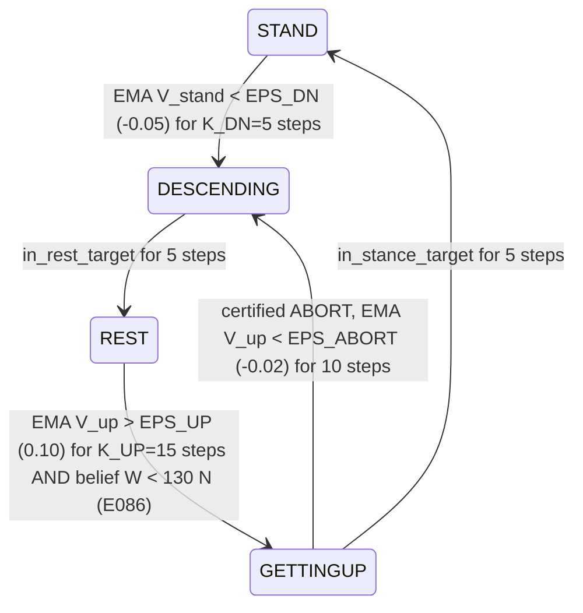
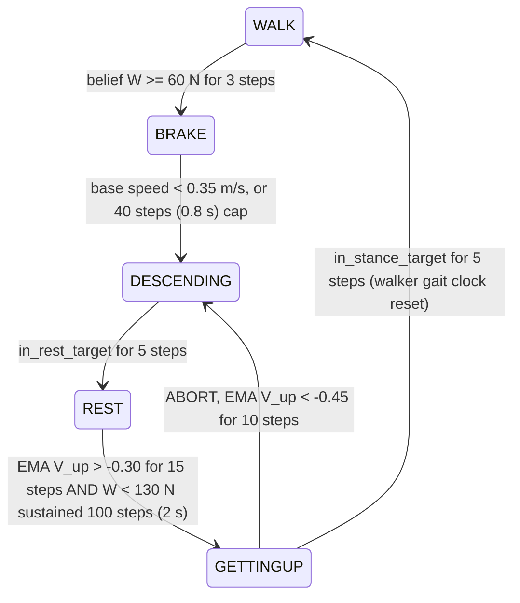

# Switching logic — what guards a transition between ODD modes

The ODD-conditioned safety filter is a small **automaton over specification modes**. Each mode has its own
reach-avoid specification, its own trained expert policy, and that expert's learned value (the mode's
**certificate**). The automaton decides *which mode's expert drives the robot*; this page states exactly
what has to be true before it moves between modes. Everything below is read off the code
(`experiments/E084_automaton.py`, `E086_single_pulse.py`, `E092_payload_walk.py`, `E091_leg_walk.py`,
`E089_goal_walk.py`); line-level constants are named so you can grep them.

Control runs at **50 Hz** (`DT = 0.02 s`), so "K steps" below means K × 20 ms.

## 1. The modes and their experts

| state | runs | trained artifact (checkpoint under `results/`) | its certificate |
|---|---|---|---|
| **STAND** (standing automaton) | stance expert | `go2_weight_runs/E075_recal/go2_weight_stand_hi_adv` ("stand_hi") | `V_stand` |
| **WALK** (walking automata) | nominal joystick walker (task policy, no safety training) | `external/go2_atomic_skills` `walker_actor.pt` | — (uses `V_stand` as a proxy only in E089) |
| **BRAKE** (walking only) | E092: stance expert stand_hi · E091: walker with zero command | — | — |
| **DESCENDING** | descent funnel `descend_v4` (arm "V2") **or** rest expert (arms "V2-REUSE", V1, ONE-WAY) | `go2_transition_runs/descend_v4/go2_descend_adv` / `go2_weight_runs/go2_weight_rest_hi_adv` | — |
| **REST** | rest expert ("rest_hi"), lie down and stay settled | `go2_weight_runs/go2_weight_rest_hi_adv` | — |
| **GETTINGUP** | get-up funnel ("getup_v2") | `go2_transition_runs/getup_v2/go2_getup_adv` | `V_up` |

Each expert is a two-player (control vs. adversarial push) reach-avoid PPO twin (`ReachAvoidPPO2P`). Its
value net gives `V(s) ≥ 0` ⇔ "this mode's spec is (estimated) still satisfiable from here". The runtime
reads it as `V = model.policy.predict_values(norm(obs))` on the 48-d actor observation (helper:
`value_of` in E084, `experiments/_value_util.py`).

## 2. Signal conditioning (shared by every automaton)

- **EMA filtering**: `v̄ ← (1−α) v̄ + α V`, `ALPHA = 0.1` (≈ 0.2 s time constant), initialised to the first
  reading (initialising at 0 caused spurious descents — E086 diagnosis).
- **Sustain counters**: a condition must hold for K *consecutive* steps; one miss resets the count to 0.
- **Warm-up**: no trigger fires during the spawn transient — `WARMUP = 50` steps (1 s) in E084/E086,
  `t ≥ 100` (2 s) in E091/E092.
- **Refractory**: after a trigger-driven switch (descend, get-up, abort), `REFRACT = 50` steps (1 s) before
  the next trigger-driven switch.
- **Target-set completion** (geometric, not learned) — a transition *finishes* only when the robot is
  actually in the next mode's target set for **5 consecutive steps**:
  - `in_rest_target`: base height < 0.15 m, tilt (max |g_x|, |g_y| of projected gravity) < 0.25,
    |v| < 0.30 m/s, |ω| < 0.50 rad/s
  - `in_stance_target`: base height > 0.20 m, tilt < 0.25, |v| < 0.30 m/s

## 3. The full system ("ODD-conditioned", internally V2 / V2-REUSE)

### Standing form (E084 load waves, E086 single excursion)

- **Descent trigger = the STAND certificate collapsing.** Standing is in-distribution for the stance
  expert, so its own value is a usable detector here.
- **Return = two keys.** The get-up funnel's own certificate `V_up` must say a get-up from *this* prone
  pose is feasible, **and** the belief must say the ODD has cleared (`UP_W_GATE = 130 N`, the measured
  stand-feasibility boundary). The belief gate is set by E086; the E084 *waves* runs use `UP_W_GATE = None`
  (certificate only).
- **Abort**: if `V_up` collapses mid-get-up (e.g. the load returns), go back down — the get-up is never
  forced to completion.

### Walking form, payload swap (E092 — the paper's main walking result)

Differences from the standing form, each forced by a measured failure:

1. **Belief-primary descent trigger** (`W_TRIG = 60`, the walking-ODD edge). `V_stand` evaluated on a
   walking gait is off-distribution: used alone it false-fired on 20–25 % of healthy gaits and fired late
   on the ramp (E092 run-1). The value is a certificate, not a fault detector.
2. **BRAKE state.** A walker given a zero command freezes its gait clock and stumbles, so braking hands
   the robot to the stance expert first, then descends once it is slow. Handoff mortality is
   *gait-phase dependent* (mid-swing dies, stance survives); ~45 % of the remaining deaths are here.
3. **Debounced return** (`UP_SUST = 100` steps = 2 s of W < 130 N). A 1.6 s false lightening of the load
   (the `dip` schedule) must not bait the robot into standing under a returning crate.
4. **Per-regime certificate thresholds** (`EPS_UP_92 = -0.30`, `EPS_ABORT_92 = -0.45`). Certificates are
   ordinal off their training distribution; the get-up threshold was recalibrated on the rest poses that
   *this* regime actually produces.

### Walking form, leg fault (E091)

Same skeleton as E092 with three changes:

- **Descent trigger = torque-saturation residual**, not the payload belief and not the value.
  `V_stand` is *blind* to unmodeled actuator faults (a hobbling robot reads `V̄ = +0.07`). The residual is
  the worst-leg mean gap between demanded PD torque and achieved actuator force, normalised by the
  nominal limit (`make_residual`); trigger when its EMA > `ERR_DEG = 0.03` for `K_DEG = 10` steps
  (0.2 s), while walking. Healthy gait reads exactly 0.0000.
- **Return belief = leg healthy** (`θ ≥ 0.99`) sustained `HEAL_SUST = 25` steps (0.5 s), plus
  `EMA V_up > -0.35` for 15 steps; abort at `< -0.45`.
- BRAKE runs the walker with a zero command (not stand_hi), and descent uses rest_hi ("V2-REUSE").

### Weight-excursion walking (E089 — boundary finding)

Value-triggered (`EMA V_stand < EPS_DN_WALK = -0.15` for 10 steps, ROC-calibrated: 1.6 % false sits per
30 s), descent by rest_hi, return as in E086 (`V_up > 0.10` for 15 steps and `W < 130`). No BRAKE state.

## 4. V1 vs V2 — what the ablation removes

**V1 = "ODD-conditioned (direct)"** (batch-1 "bidirectional" automaton). **V2 = the full system**
("ODD-conditioned"). They use the **same mode experts and the same descent trigger**. They differ in
**how the robot comes back** — the certified bridge — and, in the V2 variant, in a dedicated descent
funnel (V2-REUSE keeps V1's rest_hi descent, isolating the return):

| | V1 — direct | V2 — certified bridge |
|---|---|---|
| states | 2 (stand/walk, rest) | 4–5 (+ DESCENDING, GETTINGUP, BRAKE) |
| return trigger | `EMA V_stand > 0.15` for 25 steps (0.5 s) — the **stand** certificate read while lying prone, i.e. far off its training distribution | `EMA V_up >` per-regime threshold for 15 steps — the **get-up funnel's own** certificate, evaluated where it was trained |
| belief gate on return | none (blind to whether the ODD has actually cleared) | required: W < 130 N (E086; sustained 2 s in E092) / leg healthy 0.5 s (E091) |
| return maneuver | switch straight back to the stand/walk policy from prone (it must get up by itself) | dedicated get-up funnel, finishes only on reaching the stance target set |
| abort | none | `V_up` collapse → back to DESCENDING |
| descent maneuver | rest_hi | dedicated descend_v4 funnel (V2) or rest_hi (V2-REUSE) |

What each piece buys (evidence; standing numbers are survival over N=256, corrected accounting —
`reference/E084-automaton/results*.json`; E094 means are over 4 reps):

- **The certified return bridge** (get-up funnel + `V_up` + belief gate + abort). Compare V1 with
  V2-REUSE, which descend the same way (rest_hi) and differ only in the return: single benign/period
  0.23 → 0.50, benign/pulse 0.30 → 0.40, waves benign/square 0.23 → 0.38. The certified get-up loses
  **zero** robots in the GETTINGUP state in every corrected standing run.
- **The dedicated descent funnel** (V2-REUSE → V2): benign/period 0.50 → 0.75, benign/pulse 0.40 →
  0.50, waves benign/sine 0.21 → 0.30. Under gusts the two are within a few points, because those deaths
  happen while still standing, before the trigger fires. (An earlier note that the two "tie everywhere"
  predates the 2026-08-23 accounting correction.)
- **Full V2 vs V1**, E094 4-rep means: single benign/period 0.74 vs 0.21, waves benign/square 0.46 vs
  0.20, gusty/sine 0.10 vs 0.02.
- **Belief debounce, walking**: in E092 `dip`, V1's blind return takes the bait and stands into the
  returning crate (0.33 success / 0.36 safe) while V2 waits it out (0.40 / 0.40). On the honest `period`
  ramp they tie (0.37/0.37 vs 0.38/0.39) — in walking the BRAKE handoff, not the return, dominates the
  deaths.

**Which internal arm is "ODD-conditioned" in each table:** V2 (dedicated descend_v4) in E084/E086/E092
and the E094 seeds; V2-REUSE (rest_hi descent) in E089 and E091, which were run before descend_v4 was
added to the walking automaton.

**ONE-WAY** = V1's descent with no return at all (safe, zero task success after the ODD change).
**STAND-ONLY / WALK-ONLY** = the task expert alone, **REST-ONLY** = the safety expert alone (the anchors:
REST-ONLY is safe 1.00 in every scenario and succeeds 0.00).

## 5. What "belief" means in these evaluations — read this before extending

The return gate and the E092 descent trigger read the **true** ODD parameter (the scheduled W, or the
scheduled leg θ for the "thermal sensor"). That is a stand-in for an estimator, justified by E018 (the
set-membership belief B̂ shrinks onto the true payload in 0.10–0.20 s and empties out-of-distribution) but
**not** closed-loop with it. The one genuinely estimated signal in the walking evaluations is E091's
torque-saturation residual (descent side). Closing the loop with B̂ — and its detection latency — is open
work (see `docs/STATUS.md`).

## 6. Where the numbers live

| constant | E084 | E086 | E089 | E091 | E092 |
|---|---|---|---|---|---|
| descent trigger | `V̄_stand<-0.05` ×5 | same | `V̄_stand<-0.15` ×10 | residual `>0.03` ×10 | `W≥60` ×3 |
| return certificate | `V̄_up>0.10` ×15 | same | same | `V̄_up>-0.35` ×15 | `V̄_up>-0.30` ×15 |
| return belief | — | `W<130` | `W<130` | `θ≥0.99` ×25 | `W<130` ×100 |
| abort | `V̄_up<-0.02` ×10 | same | same | `V̄_up<-0.45` ×10 | `V̄_up<-0.45` ×10 |
| V1 return | `V̄_stand>0.15` ×25 | same | same | same | same |
| warm-up / refractory | 1 s / 1 s | 1 s / 1 s | 1 s / 1 s | 2 s / 1 s | 2 s / 1 s |
